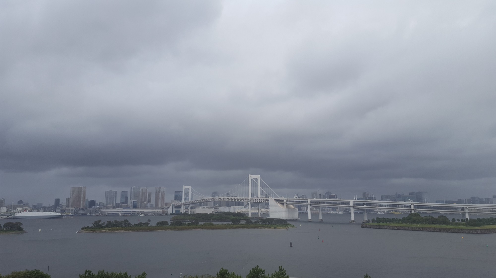

# [翻译]Angular 路由器三部曲之路由状态及 URL 匹配

> 原文连接：**[The Three Pillars of the Angular Router — Router States and URL Matching](https://blog.angularindepth.com/angular-routing-series-pillar-1-router-states-and-url-matching-12520e62d0fc)**

